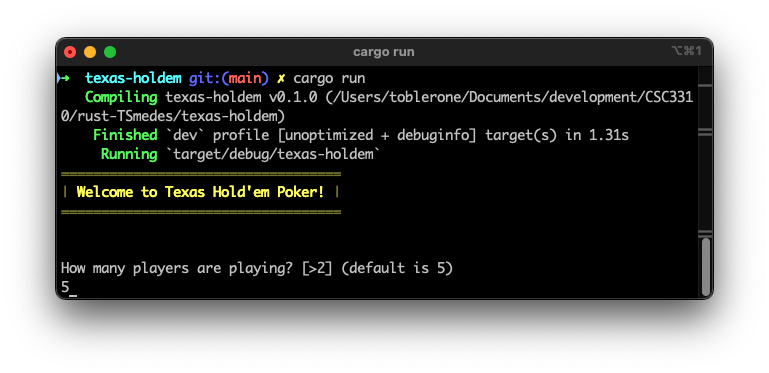
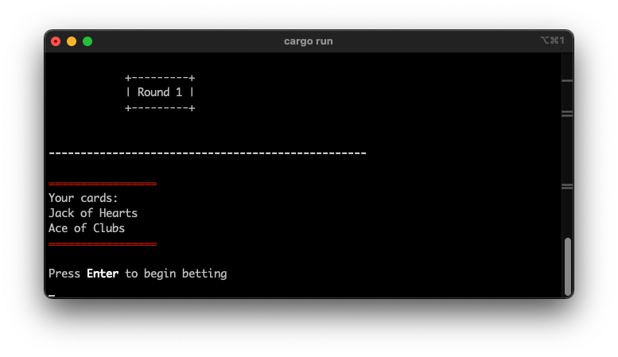
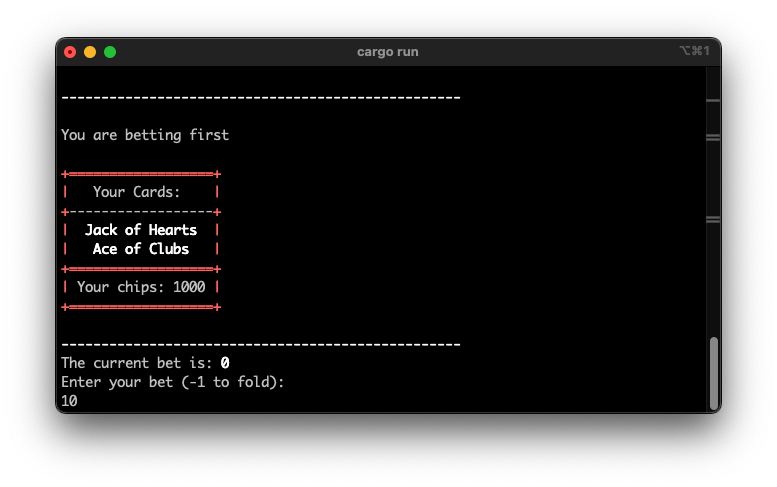
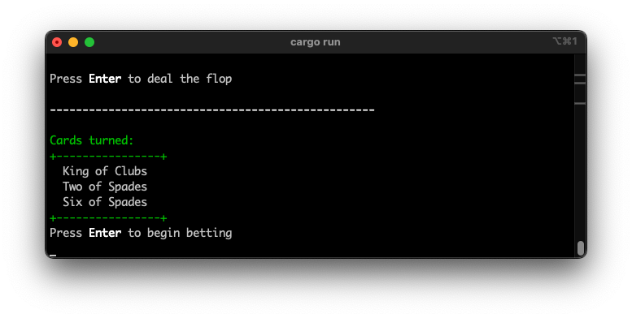
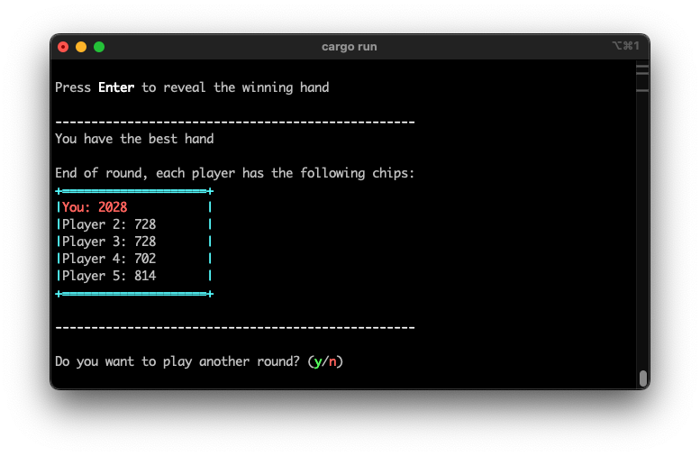

# Texas Hold'em Poker

## Description
This is a command-line implementation of Texas Hold'em Poker written in Rust. The game allows the user to play against multiple computer players, with each player starting with a set number of chips. Players can bet, and try to win the pot by having the best hand at the end of each round.

## How to Run
1. Ensure you have Rust installed on your machine. If not, you can install it from [here](https://www.rust-lang.org/tools/install).
2. Clone the repository to your local machine.
3. Navigate to the project's directory.
4. Navigate to the game's directory using the following command:
    ```sh
    cd texas-holdem
    ```
5. Run the game using the following command:
    ```sh
    cargo run
    ```

## How to Play

In Texas Hold'em Poker, player's are dealt several cards and are trying to have the highest ranking hand (the player's cards) of all players. Several series of betting rounds will occur where players have the opportunity of placing bets on how confident they are to have the highest hand.

When the betting rounds conclude, the remaining players compare their hands to see who has the highest ranking hand and who wins the money.

The following are the possible card combinations in a player's hand, from lowest to highest.

| Hand|Description|
|:--------------:|-----------|
| High Card      | The highest card in the hand when no other combination is made.|
| One Pair       | Two cards of the same rank.                                    |
| Two Pair       | Two different pairs of cards.                                  |
| Three of a Kind| Three cards of the same rank.                                  |
| Straight       | Five consecutive cards of different suits.                     |
| Flush          | Five cards of the same suit, not in sequence.                  |
| Full House     | Three cards of one rank and two cards of another rank.         |
| Four of a Kind | Four cards of the same rank.                                   |
| Straight Flush | Five consecutive cards of the same suit.                       |
| Royal Flush    | The highest straight flush (10, J, Q, K, A of the same suit).   |

In the case where multiple players have the same, highest hand, hands are then compared by the sum of the ranks of their cards, and then by the sum of the suits of their cards. In these cases of ties, the following ordering of card ranks and suits are used, from lowest to highest.

- Rank
    1. Two
    2. Three
    3. Four
    4. Five
    5. Six
    6. Seven
    7. Eight
    8. Nine
    9. Ten
    10. Jack
    11. Queen
    12. King
    13. Ace

- Suit
    1. Clubs
    2. Diamonds
    3. Hearts
    4. Spades

### Gameplay is conducted in the following manner:

1. The game will prompt you to enter the number of players and the starting chips for each player.
    - A default of 5 players and 1000 chips will be used if no input is provided
2. Each player will be dealt two cards, and the first betting round will begin with the user.
    - During the betting rounds, there are 2 possible scenarios for the player, and 3 possible choices for each scenario
        1. The player is the first player to bet, or there are no non-zero bets on the table
            1. Check (bet 0)
            2. Raise the bet (bet non-zero)
            3. Fold (forfeit round)
        2. There is a non-zero bet on the table
            1. Call (match the highest bet)
            2. Raise (match the highest bet and raise it)
            3. Fold (forfeit round)
    - Betting cycles through the players and repeats until all players have done 1 or more of the following:
        1. Match the current highest bet
        2. Fold (forfeit round)
3. After the first betting round, the flop (three community cards) will be dealt, followed by another betting round (see step 2).
    - These community cards (and future additions) are cards that may be used by all players. They are effectively added to each player's hand.
4. The turn (fourth community card) will be dealt, followed by another betting round (see step 2).
5. The river (fifth community card) will be dealt, followed by the final betting round (see step 2).
6. The player with the best hand wins the pot.

### Screenshots of Gameplay

This is the title screen should appear after using the `cargo run` command.

This is what appears after the round begins, and your cards are dealt.

This is a view of the betting round. You will be shown your cards, any community cards that have been dealt, and you current amount of chips remaining.

After the betting rounds, you will be able to see the new communal cards that have been dealt.

When all betting concludes, the winner will be declared, and final chip amount will be displayed.


### YouTube Demo
This is a brief demonstration of how to play.

[Watch the gameplay video](https://youtu.be/C376Qq5Nx9A)

## Data Types
- **Enums**: 
    - Used to define the `Suit`, `Rank`, and `Hand` types.
    - These types enumerate specific values that correspond to them.
        > See Sebesta 6.4
- **Structs**: 
    - Used to define the `Card`, `Deck`, `Player`, and `HandScore` types.
    - These types contain 1 or more fields that contain values of different types.
    - They are used as objects to store information.
        > See Sebesta 6.7
- **Vectors**: 
    - Used to store collections of cards and players.
    - Vectors are what Rust calls Lists and are a linear, variable-length data structure that contains elements of a single type.
        > See Sebesta 6.9
- **Primitive Data Types**:
    - ***Integers***:
        - Used to store numbers representing things like scores, poker chips, and vector sizes.
        - Rust uses several types of integers, like: `i32`, `i16`, `u32`, `usize`.
            > See Sebesta 6.2.1.1
    - ***Booleans***:
        - Used to store things like loop states.
        - Simple primitve type representing true or false.
            > See Sebesta 6.2.2

## Difficulties and Solutions
### Learning Rust
Learning the Rust programming language was an entire challenge in of itself.
- I have never used Rust before, so this was a big hurdle in getting started on this project.
- There are many conventions in Rust that I am not used to from using other programming languages, like variable being immutable by default.

**Solution**: Reading Rust docs extensively, watching YouTube tutorials, studying publicly available Rust code examples.

### Winning Hand Logic
Implementing the logic to determine the best hand was a challenge.
- The method I used to determing the ultimate winning hand is not exactly the same criteria used in traditional Texas Hold'em. In typical Texas Hold'em, if 2 players have the same rank of hand, high cards are checked of the hand in order. For example, if 2 players each have a full house, the winner is the player with the higher rank of their 3-of-a-kind. In my algorithm, in this case the winner is the player with the higher sum of all their card ranks. This is a simpler solution, but in the majority of cases, behaves the same as in typical Texas Hold'em.
- I struggled for some time with some players appearing to have an equal hand when they, in fact, did not.

**Solution**: I changed my method of scoring players' hands to the one mentioned above. This allowed me to complete a working algorithm so I could focus on more pressing features.


## The Good, the Bad and the Ugly
### The Good
- I learned a lot about Rust and its powerful solution to memory management. I am glad to be able to add another tool to my list of experiences.
- I am proud to have produced a working version of this game and to be able to display my skills in this way.

### The Bad
- Debugging the hand evaluation logic was challenging and quite time-consuming.
- Dealing with command line formatting can be difficult.

### The Ugly
- The game lacks a graphical user interface, which could make it more engaging and interesting.

## Learning Experience
This assignment provided me with a deep dive into Rust's features and types, including enums, structs, and ownership & borrowing. It also gave me experience with learning a new programming language. This can help me in the future if I ever have to learn an entirely new language, I have more experience with doing so. Overall, it was a valuable learning experience.